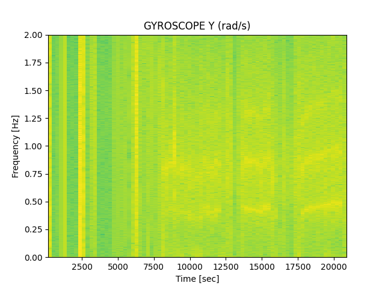

# Analysis of data logged during rowing trip.

All data used in this project is available at https://archive.org/details/rowing_data.

As an initial glimpse of what the dataset comprises of, a spectrogram of one of the measured gyroscope channels are shown below. 
The signal is low-pass filtered at 2Hz and the log(spectrogram^2) is plotted.

In general the spectogram shows broad vertical bands where there were no rowing activity (lunch break :)) and horizontal bright stripes at the rowing frequncy (~0.4Hz) and its harmonics.

